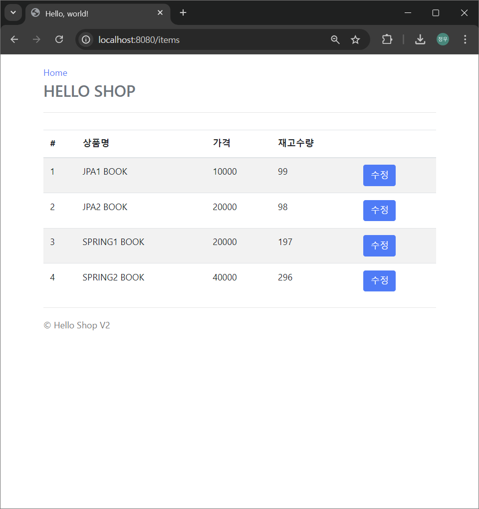

# 실전! 스프링 부트와 JPA 활용1 - 웹 애플리케이션 개발

인프런에서 제공하는 ["실전! 스프링 부트와 JPA 활용1 - 웹 애플리케이션 개발"](https://www.inflearn.com/course/%EC%8A%A4%ED%94%84%EB%A7%81%EB%B6%80%ED%8A%B8-JPA-%ED%99%9C%EC%9A%A9-1) 강좌의 학습 자료를 포함하고 있습니다. 

이 강좌는 Spring Boot와 JPA(Java Persistence API)를 활용한 웹 애플리케이션 개발 방법을 다루며, 기본적인 CRUD 기능부터 고급 기능까지 단계적으로 학습하는 것을 목표로 합니다.

## 포함된 자료

0. **실전! 스프링 부트와 JPA 활용1 - 웹 애플리케이션 개발**
1. **프로젝트 환경설정**
2. **도메인 분석 설계**
3. **애플리케이션 구현 준비**
4. **회원 도메인 개발**
5. **상품 도메인 개발**
6. **주문 도메인 개발**
7. **웹 계층 개발**

## 사전 준비물

1. **Java 17 이상** 설치
2. **IntelliJ IDEA** 설치
3. **H2 Database 2.1.214 이상** 설치

## 프로젝트 설정

1. **Project**: Gradle - Groovy
2. **Language**: Java
3. **Spring Boot**: 3.3.3
4. **Packaging**: Jar
5. **Java**: 17
6. **Group**: jpabook
7. **Artifact**: jpashop
8. **Dependencies**: Spring Web, Thymeleaf, Spring Data JPA, H2 Database, Lombok, Validation

## 실행 이미지
1. 홈 페이지
- 
2. 회원 가입 페이지
- 
3. 회원 목록 페이지
- 
4. 상품 등록 페이지
- 
5. 상품 목록 페이지
- 
6. 상품 수정 페이지
- 
7. 상품 주문 페이지
- 
8. 주문 내역 페이지
- 
